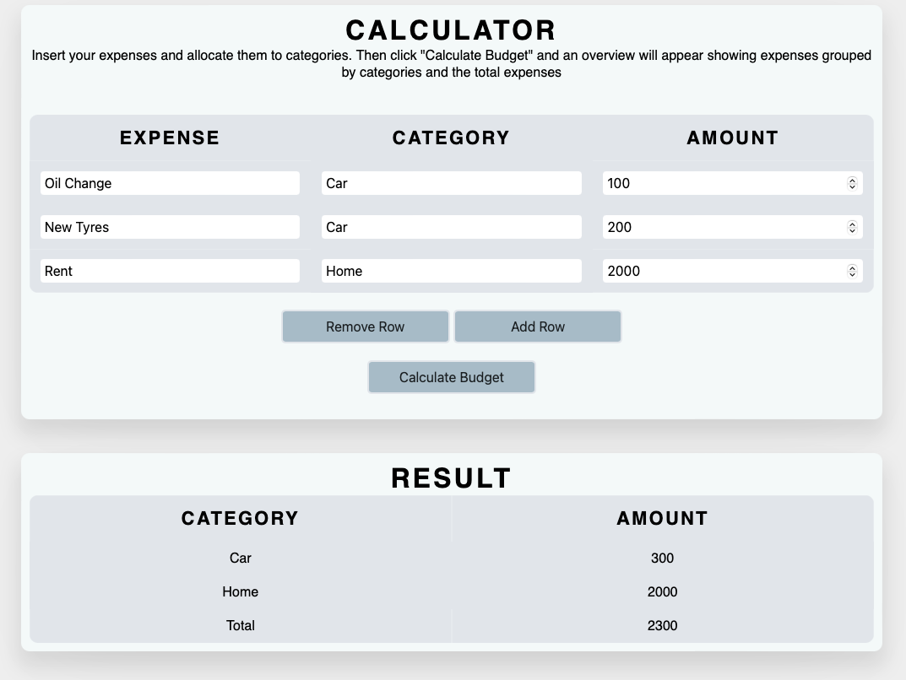

# Simple Budget Calculator
A small project to test Spring MVC capabilities for Web Development purposes. You may enter your expense names 
and categorize them. Add an amount per expense and hit the calculate button. A grouped total of your expenses will
be displayed. A live version can be found here https://simplebudgetcalc.herokuapp.com/ (please allow some seconds for the server to spin up)

Disclaimer: This project is still in development and nowhere near finished :)

---
Improvements to do:
- Animations
- Refactor js code
- General CSS improvements
- Improved Error Handling Server-Side
- Let user input a salary and show difference
